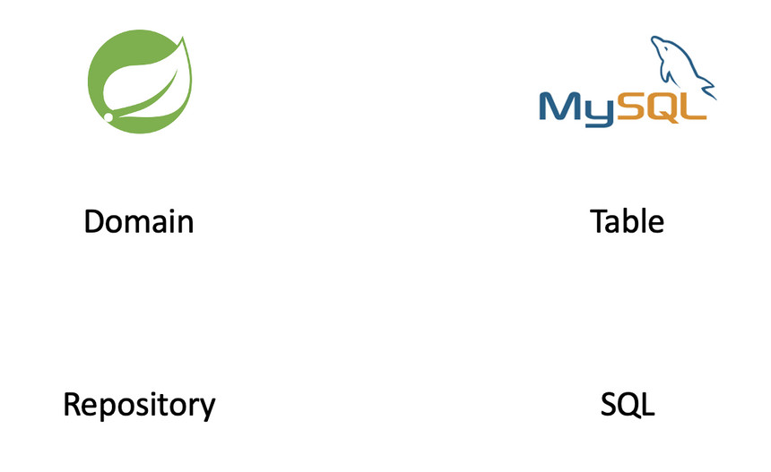

# 수주 관리 웹 프로젝트

부모님의 회사에 사용될 수주 관리 프로그램 

현재 엑셀로 관리 중이지만 대충 만들었기에 부족한 점도 많고 고쳐야 할 점도 많아서 Spring강의 참고로 조금씩 만들어 완성할 예정

---

## 필요 사항

+ 회사명
+ 품목
+ 품목 코드(특정 회사에만 적용)
+ 단가
+ 수량
+ 총액
+ 발주일
+ 납기일

위 필요 사항을 토대로 만든 테이블 생성 코드

``` mysql
CREATE TABLE IF NOT EXISTS management (
id bigint(5) NOT NULL AUTO_INCREMENT,
company_name varchar(255) NOT NULL,
product_name varchar(255) NOT NULL,
product_code varchar(255) ,
price int(10) NOT NULL,
quantity int(10) NOT NULL,
sum int(10) NOT NULL,
order_date date,
due_date date,
PRIMARY KEY (id)
);
```


## 진행 상황

### 07/07(JPA 써보기)


#### JAP가 무엇이고 왜 사용하는가

---

**JPA(Java Persistence API)**

+ Java 진영에서 ORM(Object-Relational Mapping) 기술 표준으로 사용하는 인터페이스 모음
+ 자바 어플리케이션에서 관계형 데이터베이스를 사용하는 방식을 정의한 인터페이스
+ 인터페이스 이기 때문에 Hibernate, OpenJPA 등이 JPA를 구현함

**JPA를 사용하는 이유**

*  **JPA는 반복적인 CRUD SQL을 처리해준다.**
* JPA를 사용하여 얻을 수 있는 가장 큰 것은 SQL아닌 객체 중심으로 개발할 수 있다는 것이다. 
  + 생산성이 좋아지고 유지보수가 수월해진다
  + 패러다임의 불일치도 해결한다

---

### JPA실습



Domain이 Table이고

Repository는 SQL이다


src > main > java > com.nk.ordermanagement에 domain 이라는 패키지를 만들고

Course.java, CourseRepository.java 파일을 만들었다.


Course.java

```java
package com.nk.ordermanagement.domain;

import lombok.NoArgsConstructor;
import org.springframework.format.annotation.DateTimeFormat;

import javax.persistence.*;
import java.sql.Date;

@NoArgsConstructor // 기본생성자를 대신 생성해줍니다.
@Entity // 테이블임을 나타냅니다.
public class Course {
    @Id // ID 값, Primary Key로 사용하겠다는 뜻입니다.
    @GeneratedValue(strategy = GenerationType.AUTO) // 자동 증가 명령입니다.
    private Long id;

    @Column(nullable = false) // 컬럼 값이고 반드시 값이 존재해야 함을 나타냅니다.
    private String company_name;//회사명

    @Column(nullable = false)
    private String product_name;{  //제품명

    private String product_code;  //제품 코드

    @Column(nullable = false)
    private int price ;  		//단가

    @Column(nullable = false)
    private int quantity ;		//수량

    @Column(nullable = false)
    private int sum ;			//총액


    @DateTimeFormat(pattern = "yyyy-MM-dd")
    private Date oredr_date ;	//수주일


    @DateTimeFormat(pattern = "yyyy-MM-dd")
    private Date due_date ;		//납기일


    public String getCompany_name() {

        return this.company_name;
    }

    public String getProduct_name() 

        return this.product_name;
    }

    public String getProduct_code() {
        return this.product_code;
    }

    public int getQuantity() {
        return this.quantity;
    }

    public int getPrice() {

        return this.price;
    }

    public int getSum() {
        return this.sum;
    }
    public Date getOredr_date() {
        return this.oredr_date;
    }
    public Date getDue_date() {
        return this.due_date;
    }

    //Date oredr_date, Date due_date
    public Course(String company_name, String product_name,String product_code,int quantity,int price,int sum) {
        this.company_name = company_name;
        this.product_name = product_name;
        this.product_code = product_code;
        this.price = price;
        this.quantity = quantity;
        this.sum = sum;
        //this.oredr_date = oredr_date;
       // this.due_date = due_date;

    }
}

```


CourseRepository.java

```java
package com.nk.ordermanagement.domain;

import com.nk.ordermanagement.domain.Course;
import org.springframework.data.jpa.repository.JpaRepository;

public interface CourseRepository extends JpaRepository<Course, Long> {
}

```

----


작동 확인을 하기 위해 임시로 동작을 시켜봤다

**SQL이 보이도록 application.properties 세팅**

```java
spring.jpa.show-sql=true
spring.datasource.url=jdbc:h2:mem:testdb;MODE=MYSQL
```


**OrderManagementApplication.java 세팅**

```java
package com.nk.ordermanagement;

import com.nk.ordermanagement.domain.Course;
import com.nk.ordermanagement.domain.CourseRepository;
import org.springframework.boot.CommandLineRunner;
import org.springframework.boot.SpringApplication;
import org.springframework.boot.autoconfigure.SpringBootApplication;
import org.springframework.context.annotation.Bean;

import java.util.List;

@SpringBootApplication
public class OrderManagementApplication {

    public static void main(String[] args) {
        SpringApplication.run(OrderManagementApplication.class, args);
    }


    @Bean
    public CommandLineRunner demo(CourseRepository repository) {
        return (args) -> {

            Course course1 = new Course("test","product","fqsd12",5,1000000,5000000);
            repository.save(course1);

            List<Course> courseList = repository.findAll();
            for(int i = 0; i< courseList.size();i++) {
                Course c = courseList.get(i);
                System.out.println(c.getCompany_name());
                System.out.println(c.getPrice());
                System.out.println(c.getProduct_code());
                System.out.println(c.getProduct_name());
                System.out.println(c.getQuantity());
            }

        };
    }


}
```


**실행 결과**

```
Hibernate: drop table if exists course CASCADE 

Hibernate: drop sequence if exists hibernate_sequence

Hibernate: create sequence hibernate_sequence start with 1 increment by 1

Hibernate: create table course (id bigint not null, company_name varchar(255) not null, due_date date, oredr_date date, price integer not null, product_code varchar(255), product_name varchar(255) not null, quantity integer not null, sum integer not null, primary key (id))
--course 테이블 생성--

Hibernate: call next value for hibernate_sequence
Hibernate: insert into course (company_name, due_date, oredr_date, price, product_code, product_name, quantity, sum, id) values (?, ?, ?, ?, ?, ?, ?, ?, ?)
--값 저장--

Hibernate: select course0_.id as id1_0_, course0_.company_name as company_2_0_, course0_.due_date as due_date3_0_, course0_.oredr_date as oredr_da4_0_, course0_.price as price5_0_, course0_.product_code as product_6_0_, course0_.product_name as product_7_0_, course0_.quantity as quantity8_0_, course0_.sum as sum9_0_ from course course0_

test
1000000
fqsd12
product
5
5000000
--출력--
```

제대로 작동 되는 걸 확인했다.

## 07/08(Service 실습)

### Creat & Read

```java
//데이터 저장 
courseRepository.save(new Course("test","product","code01",5,10,50));

//데이터 모두 조회
List<Course> courseList = courseRepository.findAll();
            for (int i=0; i<courseList.size(); i++) {
                Course course = courseList.get(i);
                System.out.println(course.getId());
                System.out.println(course.getCompany_name());
                System.out.println(course.getProduct_name());
                System.out.println(course.getProduct_code());
                System.out.println(course.getQuantity());
                System.out.println(course.getPrice());
                System.out.println(course.getSum());
            }

//데이터 하나만 조회
Course course = repository.findById(1L).orElseThrow(
        () -> new IllegalArgumentException("해당 아이디가 존재하지 않습니다.")
);

```


### Update

Course class에 update method 추가

```java
    public void update(Course course) {
        this.company_name = course.company_name;
        this.product_name = course.product_name;
        this.product_code = course.product_code;
        this.price = course.price;
        this.quantity = course.quantity;
        this.sum = course.sum;
        //this.oredr_date = course.oredr_date;
       // this.due_date = course.due_date;
    }
```


src > main > java > com.nk.ordermanagement > service package생성

CourseService.java 생성

CourseService.java

```java
@Service // 스프링에게 이 클래스는 서비스임을 명시
public class CourseService {

		// final: 서비스에게 꼭 필요한 녀석임을 명시
    private final CourseRepository courseRepository;

		// 생성자를 통해, Service 클래스를 만들 때 꼭 Repository를 넣어주도록
		// 스프링에게 알려줌
    public CourseService(CourseRepository courseRepository) {
        this.courseRepository = courseRepository;
    }

    @Transactional // SQL 쿼리가 일어나야 함을 스프링에게 알려줌
    public Long update(Long id, Course course) {
        Course course1 = courseRepository.findById(id).orElseThrow(
                () -> new IllegalArgumentException("해당 아이디가 존재하지 않습니다.")
        );
        course1.update(course);
        return course1.getId();
    }
}
```

### Update & Delete연습

OrderManagementApplication.java

```java
 @Bean
    public CommandLineRunner demo(CourseRepository courseRepository, CourseService courseService) {
        return (args) -> {
          //첫번째 데이터 저장
            courseRepository.save(new Course("test", "product","code01",5,10,50));

          //데이터 출력
            System.out.println("데이터 인쇄");
            List<Course> courseList = courseRepository.findAll();
            for (int i=0; i<courseList.size(); i++) {
                Course course = courseList.get(i);
                System.out.println(course.getId());
                System.out.println(course.getCompany_name());
                System.out.println(course.getProduct_name());
                System.out.println(course.getProduct_code());
                System.out.println(course.getQuantity());
                System.out.println(course.getPrice());
                System.out.println(course.getSum());
            }

          //데이터 수정
            Course new_course = new Course("test01", "product01","code02",15,20,300);
          //update 실행
            courseService.update(1L, new_course);
          //수정된 데이터 출력
            courseList = courseRepository.findAll();
            for (int i=0; i<courseList.size(); i++) {
                Course course = courseList.get(i);
                System.out.println(course.getId());
                System.out.println(course.getCompany_name());
                System.out.println(course.getProduct_name());
                System.out.println(course.getProduct_code());
                System.out.println(course.getQuantity());
                System.out.println(course.getPrice());
                System.out.println(course.getSum());
            }
          //데이터 삭제
            courseRepository.deleteAll();
        };
    }}
```

실행 결과

```
----------------------데이터 저장-----------------------
Hibernate: select course0_.id as id1_0_, course0_.created_at as created_2_0_, course0_.modified_at as modified3_0_, course0_.company_name as company_4_0_, course0_.due_date as due_date5_0_, course0_.oredr_date as oredr_da6_0_, course0_.price as price7_0_, course0_.product_code as product_8_0_, course0_.product_name as product_9_0_, course0_.quantity as quantit10_0_, course0_.sum as sum11_0_ from course course0_
1
test
product
code01
5
10
50
----------------------데이터 업데이트-----------------------
Hibernate: select course0_.id as id1_0_0_, course0_.created_at as created_2_0_0_, course0_.modified_at as modified3_0_0_, course0_.company_name as company_4_0_0_, course0_.due_date as due_date5_0_0_, course0_.oredr_date as oredr_da6_0_0_, course0_.price as price7_0_0_, course0_.product_code as product_8_0_0_, course0_.product_name as product_9_0_0_, course0_.quantity as quantit10_0_0_, course0_.sum as sum11_0_0_ from course course0_ where course0_.id=?
Hibernate: update course set created_at=?, modified_at=?, company_name=?, due_date=?, oredr_date=?, price=?, product_code=?, product_name=?, quantity=?, sum=? where id=?
Hibernate: select course0_.id as id1_0_, course0_.created_at as created_2_0_, course0_.modified_at as modified3_0_, course0_.company_name as company_4_0_, course0_.due_date as due_date5_0_, course0_.oredr_date as oredr_da6_0_, course0_.price as price7_0_, course0_.product_code as product_8_0_, course0_.product_name as product_9_0_, course0_.quantity as quantit10_0_, course0_.sum as sum11_0_ from course course0_
1
test01
product01
code02
15
20
300
-----------------------데이터 삭제-----------------------
Hibernate: select course0_.id as id1_0_, course0_.created_at as created_2_0_, course0_.modified_at as modified3_0_, course0_.company_name as company_4_0_, course0_.due_date as due_date5_0_, course0_.oredr_date as oredr_da6_0_, course0_.price as price7_0_, course0_.product_code as product_8_0_, course0_.product_name as product_9_0_, course0_.quantity as quantit10_0_, course0_.sum as sum11_0_ from course course0_
Hibernate: delete from course where id=?
```


## 07/10 (Lombok & DTO)

### Lombok

Java의 라이브러리로 반복되는 메소드를 `Annotation`을 사용해서 자동으로 작성해주는 라이브러리다. 

보통 DTO나 Model, Entity의 경우 여러 속성이 존재하고 이들이 가지는 프로퍼티에 대해서 Getter나 Setter, 생성자 등을 매번 작성해줘야 하는 경우가 많은데 이러한 부분을 자동으로 만들어주는 라이브러리라고 할 수 있다.

Course.java

```java
  public String getCompany_name() {

        return this.company_name;
    }

    public String getProduct_name() 

        return this.product_name;
    }

    public String getProduct_code() {
        return this.product_code;
    }

    public int getQuantity() {
        return this.quantity;
    }

    public int getPrice() {

        return this.price;
    }

    public int getSum() {
        return this.sum;
    }
    public Date getOredr_date() {
        return this.oredr_date;
    }
    public Date getDue_date() {
        return this.due_date;
    }


```

Getter가 잔뜩 적혀 있는 Course파일을

```java
import lombok.Getter;
import lombok.NoArgsConstructor;

@Getter
//@Getter와 @Setter를 클래스 이름 위에 적용시키면 모든 변수들에 적용이 가능하고, 변수 이름 위에 적용시키면 해당 변수들만 적용 가능하다.

@NoArgsConstructor
//@NoArgsConstructor는 어떠한 변수도 사용하지 않는 기본 생성자를 자동완성 시켜주는 어노테이션이다. @NoArgsConstructor를 활용한 예제는 아래와 같다

```

이렇게 추가하면 깔끔하게 사라진다.

또한 CourseService.java

```java
public CourseService(CourseRepository courseRepository) {
        this.courseRepository = courseRepository;
    }
```

CourseService가 시작할때마다 CourseRepository를 알아서 생성하도록해 맴버변수로 전달하도록 했다. 이것을

```java
import lombok.RequiredArgsConstructor;
@RequiredArgsConstructor
/*
@RequiredArgsConstructor는 특정 변수만을 활용하는 생성자를 자동완성 시켜주는 어노테이션이다. 
생성자의 인자로 추가할 변수에 @NonNull 어노테이션을 붙여서 해당 변수를 생성자의 인자로 추가할 수 있다. 아니면 해당 변수를 final로 선언해도 의존성을 주입받을 수 있다.
*/
```

를 추가해서 사용하지 않도록 했다

이렇게 Lombok을 사용해 코드를 효율적으로 단축해보았다.

### DTO

DTO(Data Transfer Object)란 계층간 데이터 교환을 위해 사용하는 객체(Java Beans)

+ 유저가 입력한 데이터를 DB에 넣는 과정
  + 유저가 자신의 브라우저에서 데이터를 입력하여 form에 있는 데이터를 DTO에 넣어서 전송한다.
  + 해당 DTO를 받은 서버가 DAO를 이용하여 데이터베이스로 데이터를 집어넣습니다.
+ 로직을 갖고 있지 않는 순수한 데이터 객체이며, getter/setter 메서드만을 갖는다.
+ 하지만 DB에서 꺼낸 값을 임의로 변경할 필요가 없기 때문에 DTO클래스에는 setter가 없다. (대신 생성자에서 값을 할당한다.)

src > main > java > com.nk.ordermanagement > domain > CourseRequestDto.java 생성

```java
package com.nk.ordermanagement.domain;

import lombok.Getter;
import lombok.NoArgsConstructor;
import lombok.RequiredArgsConstructor;
import lombok.Setter;
import org.springframework.format.annotation.DateTimeFormat;

import javax.persistence.Column;
import java.sql.Date;

@RequiredArgsConstructor
@Getter
@Setter
public class CourseRequestDto {
    private final String company_name;//회사명
    private final String product_name; //제품명
    private final String product_code;  //제품 코드
    private final int price ;  		//단가
    private final int quantity ;		//수량
    private final int sum ;			//총액
    private Date oredr_date ;	//수주일
    private Date due_date ;		//납기일
    }

```

이렇게 생성 후 코드를 변경해준다

CourseService.java

```java
    public Long update(Long id, Course course) {
        Course course1 = courseRepository.findById(id).orElseThrow(
                () -> new IllegalArgumentException("해당 아이디가 존재하지 않습니다.")
        );
        course1.update(course);
        return course1.getId();
    }
```


```java
    public Long update(Long id, CourseRequestDto requestDto) {
        Course course1 = courseRepository.findById(id).orElseThrow(
                () -> new IllegalArgumentException("해당 아이디가 존재하지 않습니다.")
        );
        course1.update(requestDto);
        return course1.getId();
    }
```

Course.java

```java
public void update(CourseRequestDto requestDto) {
        this.company_name = requestDto.getCompany_name();
        this.product_name = requestDto.getProduct_name();
        this.product_code = requestDto.getProduct_code();
        this.price = requestDto.getPrice();
        this.quantity = requestDto.getQuantity();
        this.sum = requestDto.getSum();
        //this.oredr_date = course.oredr_date;
       // this.due_date = course.due_date;
    }
```

OrderManagemnetApplicationTests.java

```java
CourseRequestDto requestDto = new CourseRequestDto("test01", "product01","code02",15,20,300);
            courseService.update(1L, requestDto);
```

코드가 상당히 줄었음에도 문제없이 잘 실행됨을 확인했다

---

## 오류

### 07/06

테스트용으로 H2 DB를 생성하고 위 코드를 입력해도 Syntax error가 발생

어디가 틀렸는지도 나오지 않아 헤매던 중 지인이 아주 간단한 해결책을 알려줌

src > main > resources > application.properties에 H2 웹콘솔을 생성했다.

```spring.h2.console.enabled=true```

 ```spring.datasource.url=jdbc:h2:mem:testdb ```

여기에

``` spring.datasource.url=jdbc:h2:mem:testdb;MODE=MYSQL```

추가로 간단히 해결

spring boot 2.1.10 이후에는 직접적으로 jdbc-url을 선언하여 h2주소 뒤에 MODE=MYSQL를 붙어야 mysql 테이블 쿼리가 정상 작동된다고 한다


출처: https://msyu1207.tistory.com/entry/spring-boot-JdbcSQLSyntaxErrorException-Syntax-error-in-SQL-statement-expected-identifier-해결-방안#toc- [로띠 로그:티스토리]